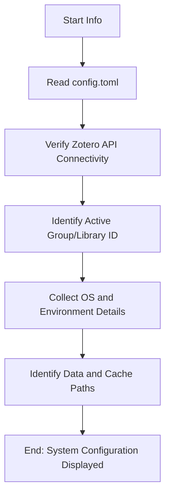

# DOC-SPEC: system info

## 1. Classification
- **Level:** 🟢 READ-ONLY (Environment Discovery)
- **Target Audience:** All Users / SysAdmin

## 2. Logic Flow (Visual Synthesis)

## 3. Synopsis
Displays the current configuration, environment variables, and connection status of your `zotero-cli` installation.

## 4. Description (Instructional Architecture)
The `system info` command is the "Diagnostic Dashboard" for the CLI. It provides a complete summary of the environment in which the tool is running. 

This command is essential for troubleshooting. It verifies that your API key is valid, shows you which Zotero library (Personal or Group) is currently active, and lists the filesystem paths used for storage and local caching. It also reports on the version of the CLI and the underlying Python environment, making it the first command you should run if you encounter unexpected behavior.

## 5. Parameter Matrix
*This command does not accept additional parameters.*

## 6. Scenario-Based Examples (Cognitive Anchors)
### Scenario: Verifying which Zotero group is active
**Problem:** I'm not sure if my commands are currently targeting my personal library or my research group's library.
**Action:** `zotero-cli system info`
**Result:** The CLI displays the "Active Library ID" and the "Library Type" (User/Group), confirming the current context.

## 7. Cognitive Safeguards
- **Common Failure Modes:** Running the command before initializing the CLI with `init`. The command will fail with a "Configuration not found" error. 
- **Safety Tips:** Use this command to confirm that your `storage_path` is correctly set before running bulk PDF fetches.
