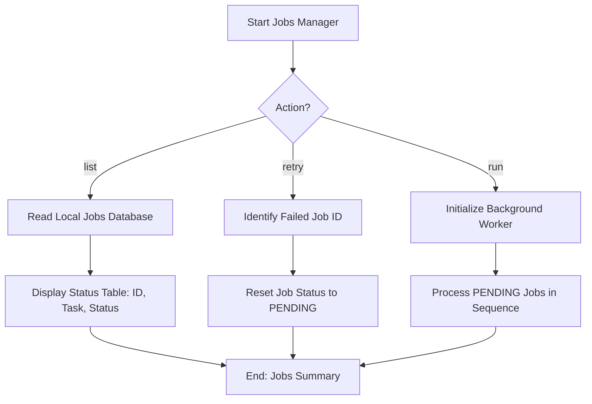

# DOC-SPEC: system jobs

## 1. Classification
- **Level:** [🟢 READ-ONLY (List) | 🟡 MODIFICATION (Retry/Run)]
- **Target Audience:** SysAdmin / Advanced User

## 2. Logic Flow (Visual Synthesis)

## 3. Synopsis
Manages long-running background tasks such as PDF fetching or SLR discovery, allowing you to monitor their progress, retry failures, or manually trigger the worker process.

## 4. Description (Instructional Architecture)
The `system jobs` command is the "Worker Supervisor" for asynchronous operations. Some tasks in `zotero-cli` (like bulk snowballing discovery or large-scale PDF fetching) are too slow to run in the foreground. These tasks are queued as "Jobs" in a local database.

- **`list`**: Shows the current queue, indicating which tasks are `PENDING`, `COMPLETED`, or `FAILED`.
- **`retry`**: Allows you to re-attempt a specific job that failed due to network issues or API rate limits.
- **`run`**: Launches the background worker that actually performs the work in the queue. This is essential for environments where a continuous background process is not already running.

## 5. Parameter Matrix
| Command | Flag | Type | Description | Ergonomic Note |
| :--- | :--- | :--- | :--- | :--- |
| `list` | *None* | - | Lists all jobs. | - |
| `retry` | `--id` | Integer | The unique identifier of the job. | Required. |
| `run` | `--workers`| Integer | Number of concurrent worker threads. | Optional. |

## 6. Scenario-Based Examples (Cognitive Anchors)
### Scenario: Monitoring a large snowballing discovery
**Problem:** I've queued 1000 DOIs for discovery and I want to see how many are finished.
**Action:** `zotero-cli system jobs list`
**Result:** The CLI displays a table showing that 800 are completed and 200 are still pending.

## 7. Cognitive Safeguards
- **Common Failure Modes:** Attempting to `retry` a job that is already running or providing an invalid job ID. 
- **Safety Tips:** If you notice many jobs failing, check your internet connection and API status via `system info` before retrying them in bulk.
