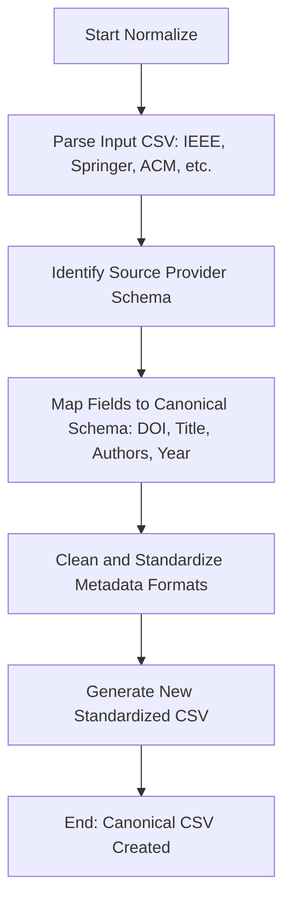

# DOC-SPEC: system normalize

## 1. Classification
- **Level:** 🟢 READ-ONLY (Data Transformation)
- **Target Audience:** Researcher / Data Analyst

## 2. Logic Flow (Visual Synthesis)

## 3. Synopsis
Converts raw search result CSV files from academic databases (like IEEE, Springer, or Scopus) into a "Canonical" format that is optimized for import into Zotero.

## 4. Description (Instructional Architecture)
The `system normalize` command is the "Data Pre-processor" for the SLR workflow. Different academic databases use wildly different column headers and data formats for their CSV exports. This inconsistency makes direct importing difficult and error-prone. 

`system normalize` solves this by recognizing the specific schema of major providers and mapping their fields to a single, unified "Canonical" CSV format. It cleans up common issues like malformed author lists, encoded characters, and inconsistent date formats. The resulting CSV is perfectly formatted for use with the `import file` command, ensuring a high-fidelity ingestion into your Zotero library.

## 5. Parameter Matrix
| Flag | Type | Description | Ergonomic Note |
| :--- | :--- | :--- | :--- |
| `file` | Path | Local path to the raw input CSV from a provider. | Positional argument. |
| `--output` | Path | File path where the normalized CSV will be saved. | Required. |

## 6. Scenario-Based Examples (Cognitive Anchors)
### Scenario: Preparing search results from multiple databases
**Problem:** I have a CSV from IEEE and another from Springer, and their headers are completely different. I want to combine them for my review.
**Action:** `zotero-cli system normalize "ieee_results.csv" --output "canonical_results.csv"`
**Result:** The IEEE data is transformed into the standard format, which I can now easily import into Zotero.

## 7. Cognitive Safeguards
- **Common Failure Modes:** Attempting to normalize a CSV from an unsupported provider or a file with corrupted formatting. 
- **Safety Tips:** Always check the normalized CSV in a spreadsheet viewer before importing. Normalization is a heuristic process and may require manual tweaks for very complex or non-standard exports.
