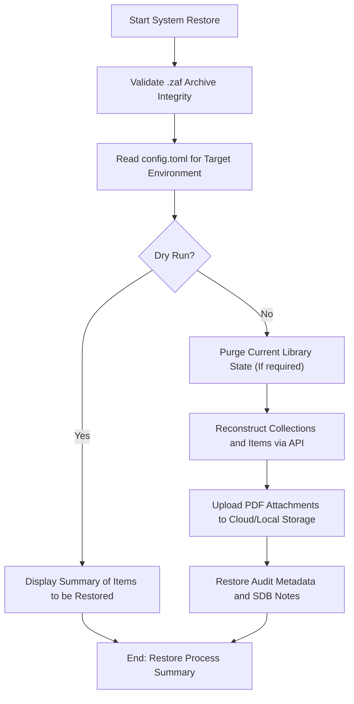

# DOC-SPEC: system restore

## 1. Classification
- **Level:** 🔴 DESTRUCTIVE (Library Overwrite/Reconstruction)
- **Target Audience:** SysAdmin / Advanced User

## 2. Logic Flow (Visual Synthesis)

## 3. Synopsis
Reconstructs an entire Zotero library or specific collections from a previously created Zotero Archive Format (`.zaf`) file.

## 4. Description (Instructional Architecture)
The `system restore` command is the counterpart to `system backup`. It allows you to re-materialize research data from an archive into a living Zotero library. This is crucial for disaster recovery, migrating between accounts, or reverting a library to a known good state after a major error. 

The command carefully parses the `.zaf` archive, identifies all bibliographic records and files, and uses the Zotero API to recreate the library structure exactly as it was when the backup was taken. This includes the recreation of folders (collections) and the re-attachment of physical PDF files. The `--dry-run` flag is an essential safety feature that allows you to see exactly what will be created or modified before the operation begins.

## 5. Parameter Matrix
| Flag | Type | Description | Ergonomic Note |
| :--- | :--- | :--- | :--- |
| `--file` | Path | Local path to the source `.zaf` archive. | Required. |
| `--dry-run` | Flag | Simulates the restore process without modifying the API. | Recommended for safety. |

## 6. Scenario-Based Examples (Cognitive Anchors)
### Scenario: Recovering from an accidental library deletion
**Problem:** I've accidentally deleted a large set of folders in Zotero and I need to restore them from last week's backup.
**Action:** `zotero-cli system restore --file "backup_2024_01_01.zaf" --dry-run`
**Result:** The CLI shows exactly which items and folders will be recreated, allowing me to proceed with confidence.

## 7. Cognitive Safeguards
- **Common Failure Modes:** Attempting to restore a `.zaf` file that is corrupted or from a different account context that lacks matching permissions. 
- **Safety Tips:** Restore operations can be complex and destructive if the target library already contains data. ALWAYS run with `--dry-run` first to understand the impact of the restore.
