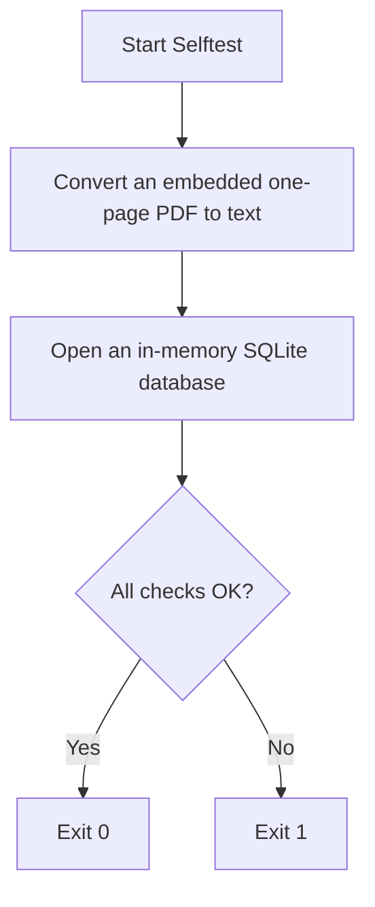

# DOC-SPEC: system selftest

## 1. Classification
- **Level:** 🟢 READ-ONLY (Installation check; offline)
- **Target Audience:** All Users / Packagers

## 2. Logic Flow (Visual Synthesis)

## 3. Synopsis
Runs offline checks of the features that depend on bundled libraries (PDF text extraction, SQLite). Needs no configuration or network.

## 4. Description (Instructional Architecture)
`system selftest` checks that this installation can actually do the work that depends on bundled libraries, not only that it starts. It converts a small PDF embedded in the program (the same code path as `item export --format md`, `collection export --format md` and `rag ingest`) and opens an in-memory SQLite database (used by `--offline`).

It reads no configuration and makes no network requests, so it can run right after installing, before `zotero-cli init`, and in CI. The release workflow runs it against every built binary.

## 5. Parameter Matrix
| Flag / Parameter | Type | Description | Ergonomic Note |
| :--- | :--- | :--- | :--- |

## 6. Scenario-Based Examples (Cognitive Anchors)
### Scenario: Checking a fresh install
**Problem:** You installed a binary or a new Python environment and want to know it works before configuring it.
**Action:** `zotero-cli system selftest`
**Result:** Each check prints OK or FAILED with a detail line; the exit status is 1 if any check failed.

## 7. Cognitive Safeguards
- **Common Failure Modes:** A FAILED "PDF text extraction" means PDF exports and `rag ingest` can't read PDFs on this install; reinstall, or include the detail line in a bug report.
- **Safety Tips:** Read-only and offline; safe to run anywhere.
