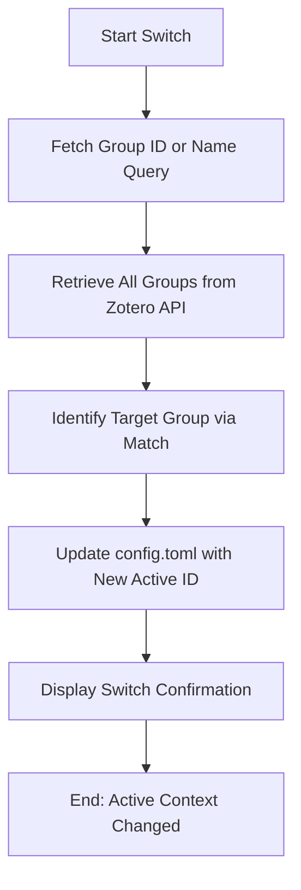

# DOC-SPEC: system switch

## 1. Classification
- **Level:** 🟡 MODIFICATION (Configuration Context Switch)
- **Target Audience:** All Users / Collaborative Lead

## 2. Logic Flow (Visual Synthesis)

## 3. Synopsis
Switches the active library context of the `zotero-cli`, allowing you to target different research groups or your personal library for all subsequent commands.

## 4. Description (Instructional Architecture)
The `system switch` command is the "Context Toggler" for your research workflow. Since the `zotero-cli` typically targets a single library at a time, this command allows you to move seamlessly between different projects. 

You can provide either the numeric `Group ID` (discovered via `system groups`) or a substring of the group's name. The command will resolve the query, identify the correct target, and update your local `config.toml` file. From that point forward, all commands (like `search`, `import`, or `collection list`) will target the newly selected group library instead of your personal one.

## 5. Parameter Matrix
| Flag | Type | Description | Ergonomic Note |
| :--- | :--- | :--- | :--- |
| `query` | String | Numeric Group ID or a partial name of the group. | Positional argument. |

## 6. Scenario-Based Examples (Cognitive Anchors)
### Scenario: Moving from personal research to a team project
**Problem:** I've finished my private search and now I want to run a screening TUI on our lab's shared collection.
**Action:** `zotero-cli system switch "AI Lab"`
**Result:** The CLI context is updated to the "AI Lab" group library.

## 7. Cognitive Safeguards
- **Common Failure Modes:** Attempting to switch to a group that you don't belong to or providing an ambiguous name that matches multiple groups. 
- **Safety Tips:** Run `system info` after switching to confirm that the "Active Library ID" correctly reflects your intended target.
