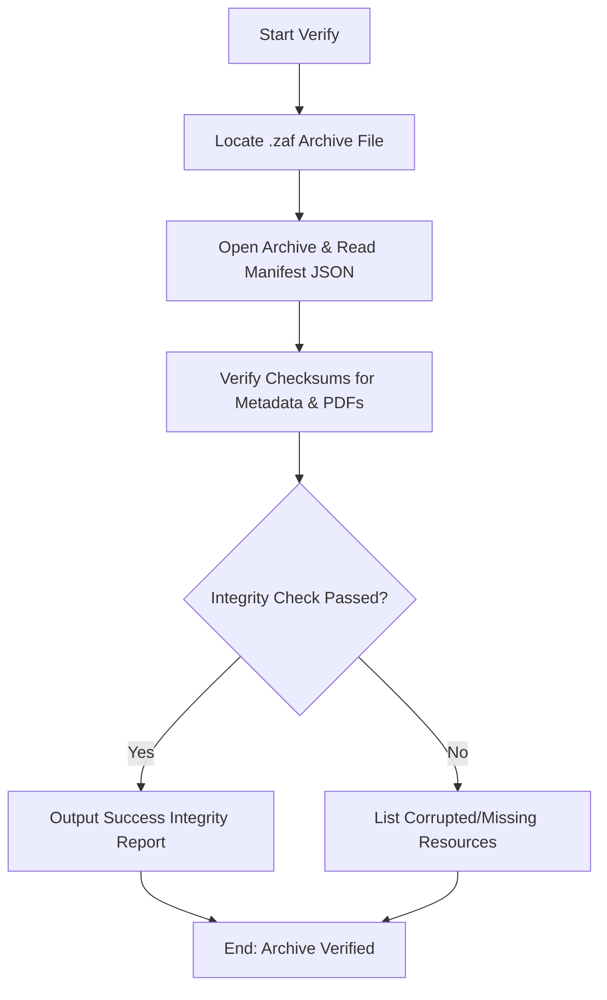

# DOC-SPEC: system verify

## 1. Classification
- **Level:** 🟢 READ-ONLY (Archive Audit)
- **Target Audience:** SysAdmin / SLR Lead

## 2. Logic Flow (Visual Synthesis)

## 3. Synopsis
Verifies the structural integrity and file checksums of a Zotero Archive Format (`.zaf`) backup file before any restoration attempt.

## 4. Description (Instructional Architecture)
The `system verify` command ensures backup preservation quality. Before restoring complex nested hierarchies or items back to a Zotero library, this command audits the target `.zaf` archive to ensure no corruption has occurred. It parses the embedded `manifest.json` metadata index, checks file paths, and recalculates SHA-256 hashes of all stored PDF/note attachments.

## 5. Parameter Matrix
| Flag / Parameter | Type | Description | Ergonomic Note |
| :--- | :--- | :--- | :--- |
| `--file` | String | Input .zaf file | Required. |

## 6. Scenario-Based Examples (Cognitive Anchors)
### Scenario: Verifying an archive before restore
**Problem:** A researcher wants to restore a library but must guarantee the backup archive is not corrupt.
**Action:** `zotero-cli system verify --file "backup_2024.zaf"`
**Result:** The CLI displays an integrity report confirming metadata and checksum validation success.

## 7. Cognitive Safeguards
- **Common Failure Modes:** Providing a file path that does not exist or attempting to read a file that is not in the correct `.zaf` ZIP format.
- **Safety Tips:** Always run `system verify` first on an archive before using the destructive/mutating `system restore` command.
