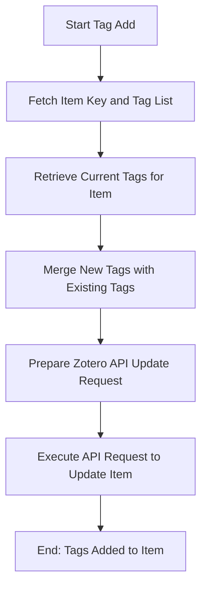

# DOC-SPEC: tag add

## 1. Classification
- **Level:** 🟡 MODIFICATION (Taxonomy Update)
- **Target Audience:** Researcher / Author

## 2. Logic Flow (Visual Synthesis)

## 3. Synopsis
Appends one or more new tags to a specific research item in your Zotero library.

## 4. Description (Instructional Architecture)
The `tag add` command is used for categorized research organization. It allows you to enrich an item's metadata with descriptive keywords directly from the terminal. 

In Zotero, tags are a powerful way to cross-reference items regardless of which collection they belong to. When you use this command, the CLI retrieves the item's current set of tags and appends your new ones to the list, ensuring that no existing data is overwritten. You can provide multiple tags at once using a comma-separated string. 

## 5. Parameter Matrix
| Flag | Type | Description | Ergonomic Note |
| :--- | :--- | :--- | :--- |
| `--item` | String | Unique Zotero Item Key (e.g., `ABCD1234`). | Required. |
| `--tags` | String | Comma-separated list of tags to add. | Required. |

## 6. Scenario-Based Examples (Cognitive Anchors)
### Scenario: Categorizing a paper for a specific project
**Problem:** I've just finished reading a paper (Key: `READ_123`) and I want to tag it with "SLR_2024" and "Must_Cite."
**Action:** `zotero-cli tag add --item "READ_123" --tags "SLR_2024,Must_Cite"`
**Result:** The paper now includes both tags in Zotero, making it easy to find using the `tag list` or Zotero's search.

## 7. Cognitive Safeguards
- **Common Failure Modes:** Attempting to add tags to an item key that does not exist. 
- **Safety Tips:** Use quotes around your tags if they contain spaces (e.g., `--tags "Artificial Intelligence,Machine Learning"`).
