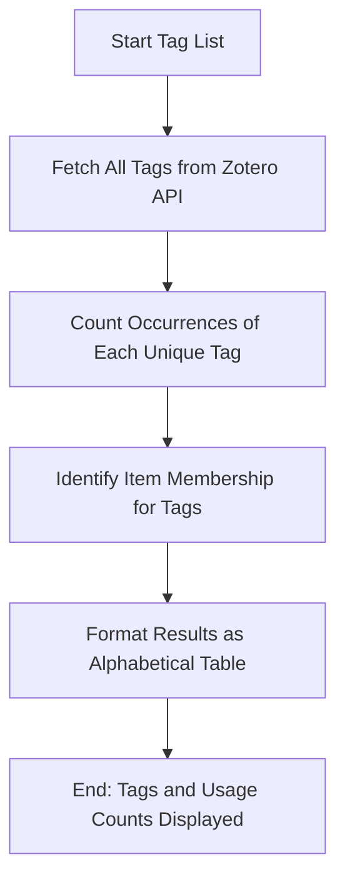

# DOC-SPEC: tag list

## 1. Classification
- **Level:** 🟢 READ-ONLY (Taxonomy Discovery)
- **Target Audience:** Researcher / Librarian

## 2. Logic Flow (Visual Synthesis)

## 3. Synopsis
Displays an alphabetical list of all unique tags used across your Zotero library, including the number of items associated with each tag.

## 4. Description (Instructional Architecture)
The `tag list` command is the "Taxonomy Audit" tool for your library. It provides a high-level view of the keywords and categories you have applied to your research items. 

The command retrieves all tags currently in use and presents them in a formatted table. This is essential for maintaining a consistent tagging strategy, as it allows you to identify near-duplicates (e.g., "AI" vs "Artificial Intelligence") or outdated terms that need consolidation. The "Count" column helps you understand the focus areas of your library by showing which topics are most heavily represented.

## 5. Parameter Matrix
*This command does not accept additional parameters.*

## 6. Scenario-Based Examples (Cognitive Anchors)
### Scenario: Auditing library categories
**Problem:** I want to know which research topics I have the most papers on, based on my tagging system.
**Action:** `zotero-cli tag list`
**Result:** The CLI displays all tags, and I can see that my "Deep Learning" tag is applied to 150 items, while "Transformers" is only applied to 20.

## 7. Cognitive Safeguards
- **Common Failure Modes:** Attempting to run the command on a very large library with thousands of unique tags, which may result in a very long terminal output. 
- **Safety Tips:** Use this list to identify tags that should be merged using the Zotero desktop client to maintain a clean and searchable research database.
