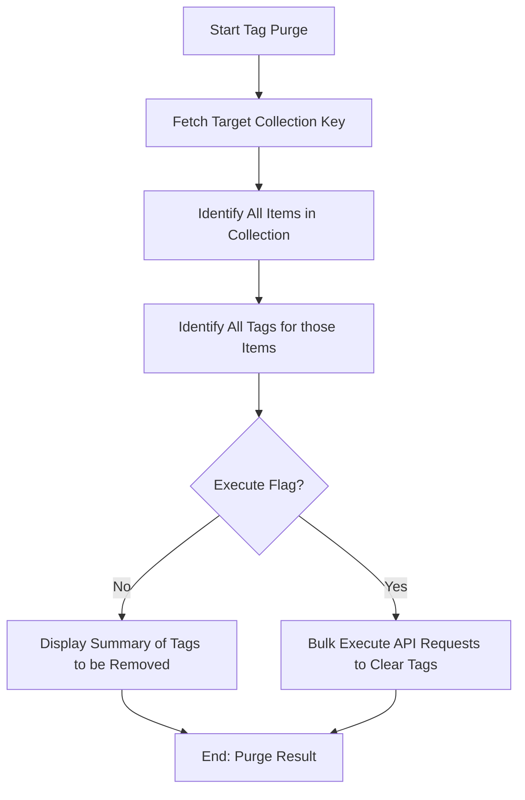

# DOC-SPEC: tag purge

## 1. Classification
- **Level:** 🔴 DESTRUCTIVE (Taxonomy Removal)
- **Target Audience:** Researcher / Librarian

## 2. Logic Flow (Visual Synthesis)

## 3. Synopsis
Removes all tags from every item within a specific collection. This command is typically used to reset the taxonomy of a folder before applying a new tagging strategy.

## 4. Description (Instructional Architecture)
The `tag purge` command is a bulk maintenance tool. It is designed for researchers who find their library's tagging system has become cluttered or inconsistent. 

The command targets a specific collection and scans all contained items. It then identifies all tags associated with those items and prepares to remove them. By default, the command runs in a "Preview" mode, showing you exactly how many items will be affected and which tags will be removed. The `--execute` flag is required to perform the actual deletions on the Zotero API. 

## 5. Parameter Matrix
| Flag | Type | Description | Ergonomic Note |
| :--- | :--- | :--- | :--- |
| `--collection` | String | Name or unique identifier (Key) of the collection. | Required. |
| `--execute` | Flag | Commits the tag removals to the Zotero API. | Omit for a safe preview. |

## 6. Scenario-Based Examples (Cognitive Anchors)
### Scenario: Resetting tags for a new project phase
**Problem:** I've imported a collection (Key: `NEW_01`) that came with a lot of messy tags from the original database, and I want to start fresh with my own codes.
**Action:** `zotero-cli tag purge --collection "NEW_01" --execute`
**Result:** All items in the collection are now tag-free, ready for a new organizational pass.

## 7. Cognitive Safeguards
- **Common Failure Modes:** Attempting to purge tags from a folder that doesn't exist or forgetting the `--execute` flag. 
- **Safety Tips:** ALWAYS run without `--execute` first to ensure you are not accidentally clearing tags from a larger set of items than intended.
