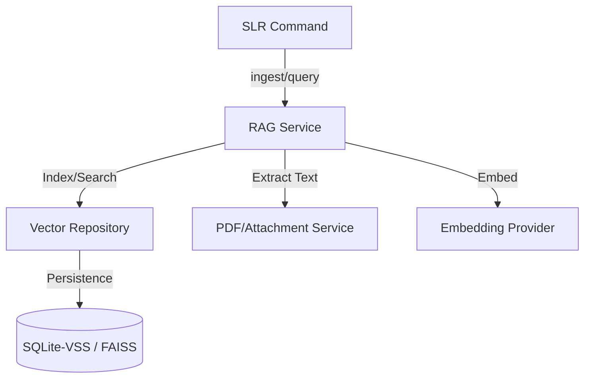

# Specification: RAG Core v1.0

**Status:** DRAFT
**Related Issues:** #93
**Author:** Hamilton (The Council)

## 1. Objective
To introduce a **Retrieval-Augmented Generation (RAG)** engine into the **SLR Core**. This allows for semantic search and context injection across the Zotero library, leveraging PDF text and item metadata.

## 2. Architecture
The RAG Core follows the **Hexagonal Architecture** pattern, providing a service for ingestion, querying, and context retrieval.

### 2.1 Component Diagram

### 2.2 Domain Service (`RAGService`)
Located at `src/zotero_cli/core/services/rag_service.py`.
- **`ingest(collection_key: str)`**:
    - Fetches items from the collection.
    - Extracts text from PDF attachments (via `AttachmentService`).
    - Chunks text (RecursiveCharacterTextSplitter pattern).
    - Generates embeddings.
    - Stores in `VectorRepository`.
- **`query(prompt: str, top_k: int = 5) -> List[SearchResult]`**:
    - Embeds the prompt.
    - Searches the vector store.
    - Returns ranked results with item metadata and text snippets.
- **`get_context(item_key: str) -> str`**:
    - Retrieves all chunks associated with a specific item.
    - Formats as a context block for LLM consumption.

### 2.3 Infrastructure (`VectorRepository`)
Located at `src/zotero_cli/infra/vector_repo.py`.
- **Engine:** **SQLite-VSS** (preferred for zero-config/local-first) or **FAISS** (fallback for easier Python-only distribution).
- **Schema:**
    - `id`: Primary Key.
    - `item_key`: Zotero Item Key (Foreign Key to `items`).
    - `chunk_index`: Sequence in the original document.
    - `text`: Raw text snippet.
    - `embedding`: Vector (Blob).

## 3. Implementation Plan
1.  **Phase 1: Foundation**
    - [ ] Create `RAGService` interface.
    - [ ] Implement `VectorRepository` (SQLite/FAISS).
2.  **Phase 2: Ingestion**
    - [ ] Integrate with `AttachmentService` for PDF text extraction.
    - [ ] Implement chunking logic.
    - [ ] Implement embedding provider (OpenAI/Local).
3.  **Phase 3: CLI & TUI**
    - [ ] Add `slr rag` subcommand.
    - [ ] Implement `ingest`, `query`, and `context` handlers.
4.  **Phase 4: Validation**
    - [ ] Add unit tests for `RAGService`.
    - [ ] Add integration tests for vector storage.
