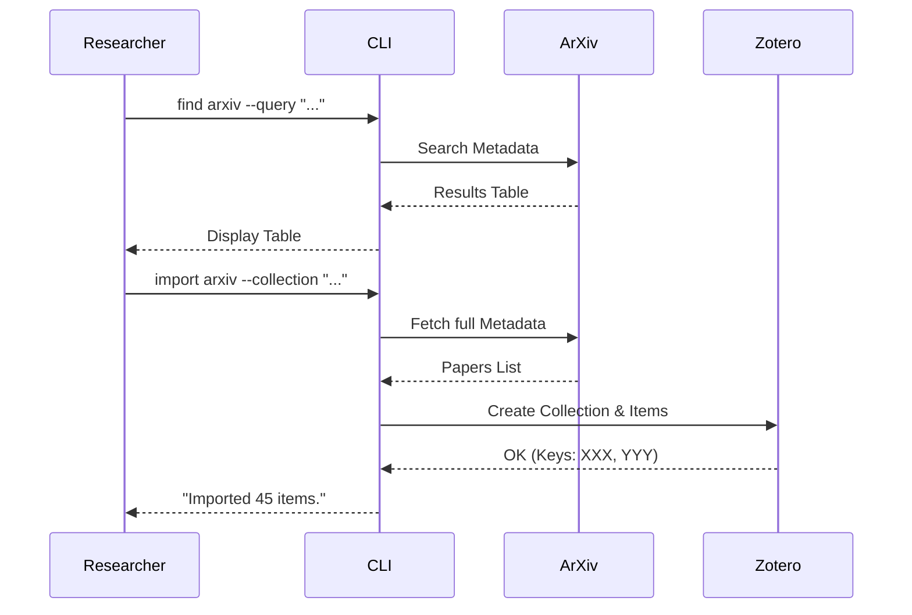

# Guided Tour 01: The First Search

Welcome to your first research cycle with **zotero-cli**. In this tour, we will simulate the start of a Systematic Literature Review (SLR) by searching for papers on ArXiv and importing them into Zotero.

## The Scenario
You are investigating **"LLM Security"**. You want to find recent papers on ArXiv and store them in a clean collection.

## Step 1: Discovery
First, we use `find arxiv` to see what's out there without adding anything to our library yet.

```bash
zotero-cli find arxiv --query "ti:LLM AND Security"
```
*Tip: We use the ArXiv advanced syntax `ti:` to search specifically in titles.*

## Step 2: Import
Now that we know there are relevant papers, let's import them into a new collection named "LLM Search".

```bash
zotero-cli import arxiv --query "ti:LLM AND Security" --collection "LLM Search"
```
**zotero-cli** will:
1. Create the collection "LLM Search" if it doesn't exist.
2. Fetch metadata for up to 100 papers.
3. Upload them to your Zotero library.

## Step 3: Verify
Let's check our new collection to see what was imported.

```bash
zotero-cli item list --collection "LLM Search"
```

## Visualizing the Flow


---
**Next Step:** [Guided Tour 02: The Title/Abstract Sprint](02-screening-sprint.md)
