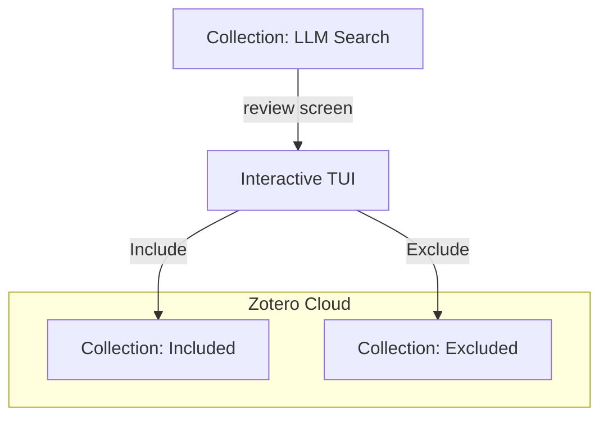

# Guided Tour 02: The Title/Abstract Sprint

Now that you have imported hundreds of papers, it's time to separate the wheat from the chaff. This is the **Screening Phase**.

## The Scenario
You have 500 papers in "LLM Search". You need to move the relevant ones to "Included" and the rest to "Excluded".

## Step 1: Initialize Collections
Ensure you have your target folders ready.

```bash
zotero-cli collection create "Included"
zotero-cli collection create "Excluded"
```

## Step 2: The TUI Sprint
Launch the interactive screening interface. This is where **zotero-cli** shines.

```bash
zotero-cli slr screen --source "LLM Search" --include "Included" --exclude "Excluded"
```

### Controls:
*   **[I]**: Include the paper.
*   **[E]**: Exclude the paper (you will be prompted for a reason).
*   **[S]**: Skip (decide later).
*   **[Q]**: Save and Quit.

## Step 3: Direct Decisions
If you already know a specific paper's fate, use the `decide` command for a quick strike.

```bash
zotero-cli slr decide --key "ABC12345" --vote "INCLUDE" --code "RELEVANT"
```

## Visualizing the Flow


---
**Next Step:** [Guided Tour 03: The Audit Trail](03-audit-trail.md)
