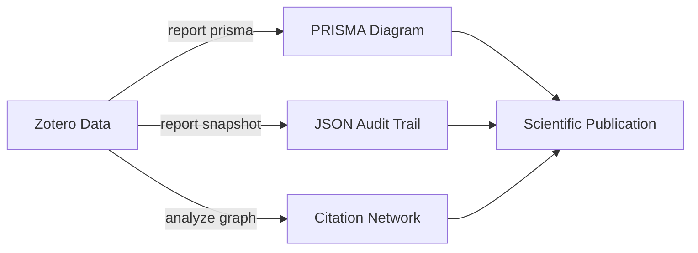

# Guided Tour 03: The Audit Trail

In a scientific review, transparency is everything. You must be able to prove *why* you included or excluded every paper.

## The Scenario
Your screening is done. You are ready to write your methodology section.

## Step 1: PRISMA Statistics
Generate the numbers for your PRISMA flow diagram.

```bash
zotero-cli report prisma --collection "Included" --output-chart "prisma_flow.png"
```
This will show you exactly how many items were screened and the breakdown of exclusion reasons.

## Step 2: Immutable Snapshot
Create a JSON snapshot of your "Included" collection. This file can be attached to your paper's supplemental material as a permanent record.

```bash
zotero-cli report snapshot --collection "Included" --output "audit_v1.json"
```

## Step 3: Synthesis Graph
Visualize how the included papers cite each other (if metadata is available).

```bash
zotero-cli analyze graph --collections "Included" > network.dot
# Use Graphviz or Mermaid to render the .dot file
```

## The Final Output
Your research is now backed by a deterministic, scriptable process.


