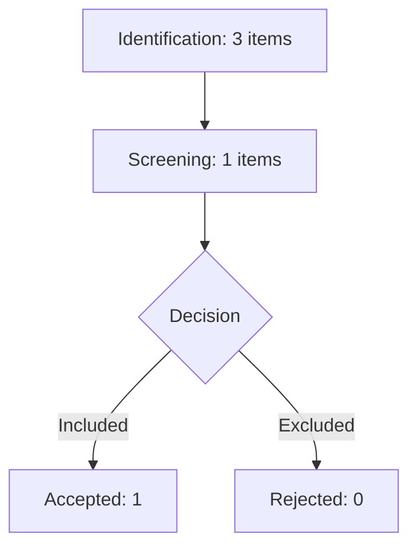

# Screening Report: E2E_Source_1768587923
**Generated:** 2026-01-16 15:25:42

## 1. Executive Summary
*   **Total Items in Collection:** 3
*   **Items Screened:** 1 (33.3%)
*   **Included (Accepted):** 1
*   **Excluded (Rejected):** 0

## 2. Rejection Reasons
| Reason Code | Count | Percentage |
| :--- | :---: | :---: |

## 3. PRISMA 2020 Flow Diagram

---
*Generated by zotero-cli Systematic Review Engine.*